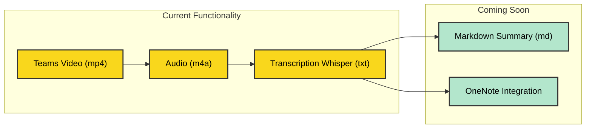

# TeamScriber ✍️🎙️

## Turn Your Teams Meetings into Actionable Insights! 🚀

Are you tired of missing crucial details from your Microsoft Teams meetings? Do you wish you could effortlessly capture and organize all those brilliant ideas and action items? Say hello to TeamScriber, your new favorite meeting companion! 🎉

## What is TeamScriber? 🤔

TeamScriber is a powerful console application that transforms your Microsoft Teams meetings into a treasure trove of organized information. It's like having a super-efficient assistant who never misses a beat!

## Features That'll Make You Go "Wow!" 😮

- **Audio Extraction** 🎵: Seamlessly pulls audio from your Teams meeting recordings.
- **Whisper-quiet Transcription** 🤫: Uses cutting-edge OpenAI Whisper technology to convert speech to text with impressive accuracy.
- **Highlight Reel** ⭐: Automatically identifies and emphasizes key points, so you don't miss the good stuff.
- **OneNote Integration** 📚: Neatly organizes all your meeting insights directly into OneNote for easy access and sharing.

## Why You'll Love TeamScriber 💖

1. **Time-Saver Extraordinaire** ⏱️: No more rewatching entire meetings or scrolling through pages of notes.
2. **Accuracy You Can Trust** 🎯: State-of-the-art transcription means you get reliable results every time.
3. **Flexibility is Key** 🔑: Works with single videos or entire directories of meeting recordings.
4. **Customization Galore** 🎨: Tailor the output to your needs with various command-line options.
5. **Multilingual Magic** 🌍: Supports multiple languages, because great ideas know no borders!

## Getting Started is a Breeze! 🌟

### For the Code Wizards 🧙‍♂️💻

1. Clone this repo: `git clone https://github.com/PatBQc/TeamScriber.git`
2. Install dependencies (check our `requirements.txt`)
3. Configure your OpenAI API key
4. Run TeamScriber with your desired options
5. Feel free to contribute! We welcome Pull Requests with open arms. Let's make TeamScriber even more awesome together! 🤝

### For Everyone Else 😎🚀

1. Head over to the [Releases](https://github.com/PatBQc/TeamScriber/releases) section of this repo
2. Download the latest version of the TeamScriber command-line tool
3. Configure your OpenAI API key
4. Run TeamScriber with your desired options
5. Watch as your meetings transform into organized, actionable insights!

No matter which path you choose, you're just moments away from revolutionizing your meeting notes! 📈✨


## Command Line Magic: Unleash the Power! 🧙‍♂️

TeamScriber is highly customizable through command line arguments. Here's how to wield this power:

```
TeamScriber.exe [options]
```

### Essential Spells (Arguments):

- `-i, --input <path>`: 📁 Specify the input video file(s) or directory. Use `|` to separate multiple paths.
  Example: `-i "C:\Meetings\video1.mp4|C:\Meetings\video2.mp4"` or `-i "C:\Meetings"`

- `-a, --audio <path>`: 🎵 Set the output directory for extracted audio files. Default: Same as video directory.

- `-f, --ffmpeg <path>`: 🎞️ Path to ffmpeg executable. TeamScriber will search in the current directory and PATH if not specified.

- `-w, --whisper`: 🤫 Toggle OpenAI Whisper for transcription. Default: true.

- `-l, --language <code>`: 🌍 Set the language for Whisper transcription (ISO-639-1 format). Default: "en".

- `-k, --openai-api-key <key>`: 🔑 Your OpenAI API key. If not provided, TeamScriber looks for the OPENAI_API_KEY environment variable.

- `-t, --transcription <path>`: 📝 Specify the output directory for transcription files. Default: Same as audio directory.

- `-v, --verbose`: 🗣️ Enable verbose mode for detailed execution information. Default: false.

### Examples to Get You Started:

1. Basic usage with a single video:
   ```
   TeamScriber.exe -i "C:\Meetings\ImportantMeeting.mp4"
   ```

2. Process multiple videos with custom output directories:
   ```
   TeamScriber.exe -i "C:\Meetings\Video1.mp4|C:\Meetings\Video2.mp4" -a "C:\Output\Audio" -t "C:\Output\Transcripts"
   ```

3. Use a specific language and enable verbose mode:
   ```
   TeamScriber.exe -i "C:\Meetings" -l "fr" -v
   ```

Remember, with great power comes great responsibility. Use these arguments wisely to unlock the full potential of TeamScriber! 🚀✨


## Join the TeamScriber Revolution! 🚀

Don't let another brilliant idea slip through the cracks. With TeamScriber, you'll be the meeting MVP, armed with perfectly transcribed notes and key insights at your fingertips.

Ready to supercharge your Teams meetings? Give TeamScriber a try today and experience the future of meeting productivity! 💼✨

*Remember: With great transcription comes great responsibility. Use your newfound meeting superpowers wisely!* 😉


## Installation 🛠️

TeamScriber is a command-line application based on .NET. We provide multiple installation options:

1. **For most users**: Download the `TeamScriber-DotNet.zip` file from the [Releases](https://github.com/PatBQc/TeamScriber/releases) section. This contains the .NET version that should work for most Windows users.

2. **For advanced users**: We also provide self-contained executables for specific architectures:
   - x86
   - x64
   - ARM

Once downloaded:
- Extract the files to your desired directory.
- For easier access, consider adding this directory to your PATH environment variable.

## System Requirements 💻

- **Windows**: A Windows machine with .NET installed.
- **Linux/Mac**: Should work if ffmpeg and .NET environment are installed. (We'd love to hear about your experience if you try this! 💟)

## Troubleshooting 🔧

Encountered an issue? We're here to help! Please [open an issue on GitHub](https://github.com/PatBQc/TeamScriber/issues) with details about your problem, and we'll look into it.

## License 📄

TeamScriber is distributed under the MIT License. See the [LICENSE](LICENSE) file for more details.

## Acknowledgments 🙏

We stand on the shoulders of giants. TeamScriber wouldn't be possible without these amazing projects:

- [ffmpeg](https://www.ffmpeg.org/)
- [NAudio](https://github.com/naudio/NAudio)
- [Betalgo.OpenAI](https://github.com/betalgo/openai)
- [CommandLineParser](https://github.com/commandlineparser/commandline)

## Roadmap 🗺️

Here's what TeamScriber can do now and what's coming up:

**Current Functionality:**
Teams Video --> Audio (m4a) --> Transcription (Whisper)

**Coming Soon:**
- Generate markdown (.md) summaries of the transcript
- OneNote integration

We're excited about the future of TeamScriber and can't wait to bring you these new features!


## TeamScriber Workflow

Here's a visual representation of TeamScriber's current functionality and upcoming features:



- Yellow boxes represent current functionality.
- Green boxes represent upcoming features.

We're constantly working to improve TeamScriber and add new features to enhance your meeting note-taking experience!